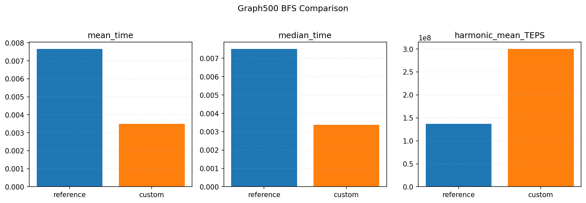
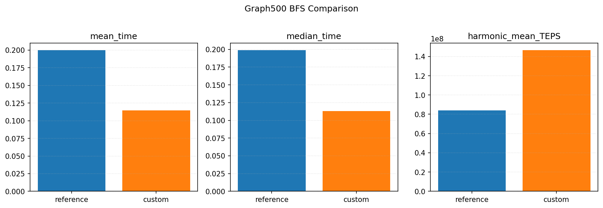
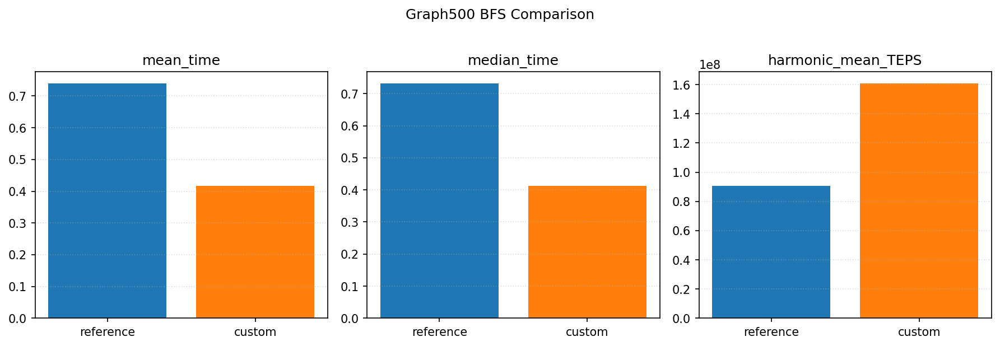
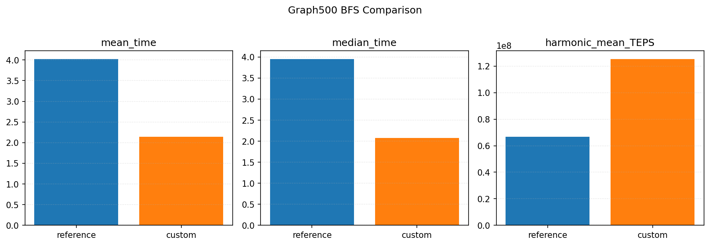
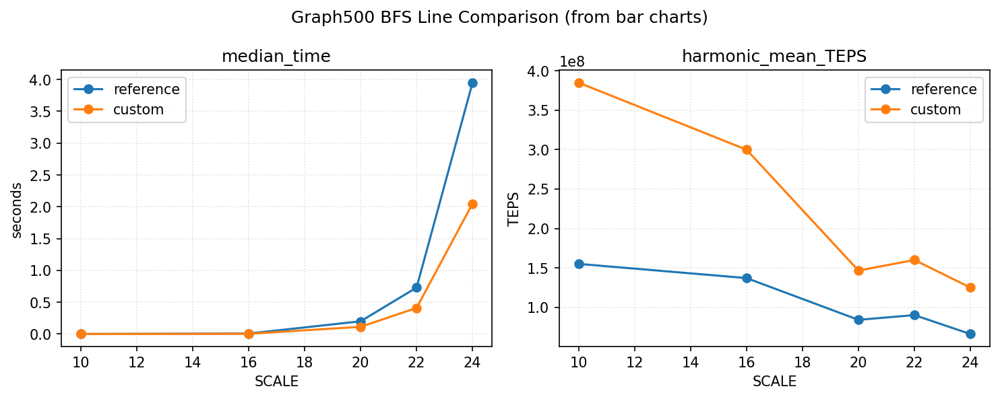

# HW1 BFS

## Python BFS (logic reference)
```python

def bfs(graph, start):
	visited = set([start])
	order = []
	queue = deque([start])

	while queue:
		node = queue.popleft()
		order.append(node)
		for neighbor in graph.get(node, []):
			if neighbor not in visited:
				visited.add(neighbor)
				queue.append(neighbor)

	return order
```
Because the Python version cannot be used directly in Graph500, I rewrote it in C and placed it into the custom BFS entry points in [src/bfs_custom.c](src/bfs_custom.c).
The C custom BFS follows the same core logic (queue + visited), translated into Graph500's CSR layout and data structures.


## Implementation Overview
- Python BFS implementation: see [bfs.py](bfs.py)
- Customed C BFS implementation (based on Graph500 framework): see [src/bfs_custom.c](src/bfs_custom.c)
- Graph500 Reference implementation: see [src/bfs_reference.c](src/bfs_reference.c)

## Run Outputs
Experiment notes:
- Each run uses 64 BFS roots (NBFS=64).
- Single-process execution on macOS.
- Scales tested: SCALE=10, 16, 20, 22, 24.

Saved output logs:
- Reference stdout/stderr: [src/graph500_reference_bfs_stdout.txt](src/graph500_reference_bfs_stdout.txt) / [src/graph500_reference_bfs_stderr.txt](src/graph500_reference_bfs_stderr.txt)
- Custom stdout/stderr: [src/graph500_custom_bfs_stdout.txt](src/graph500_custom_bfs_stdout.txt) / [src/graph500_custom_bfs_stderr.txt](src/graph500_custom_bfs_stderr.txt)

## Comparison Plot (SCALE=10)


## Comparison Plot (SCALE=16)


## Comparison Plot (SCALE=20)


## Comparison Plot (SCALE=22)


## Comparison Plot (SCALE=24)


## Line Plot (median_time & harmonic_mean_TEPS)


Plots are generated by [compare_results.py](compare_results.py).

## Example Commands
Reference (SCALE=10):
```
 ./graph500_reference_bfs 10
```
Custom (SCALE=10): 
```
 ./graph500_custom_bfs 10
```

## Analysis
Under single-process execution, the custom BFS achieves lower runtime and higher TEPS than the Graph500 reference implementation at both SCALE=10 and SCALE=16. This is expected because the reference code is designed for parallel and distributed environments and retains additional abstraction and coordination overhead, which does not provide an advantage in a purely local setting. As SCALE increases, the performance gap narrows.
