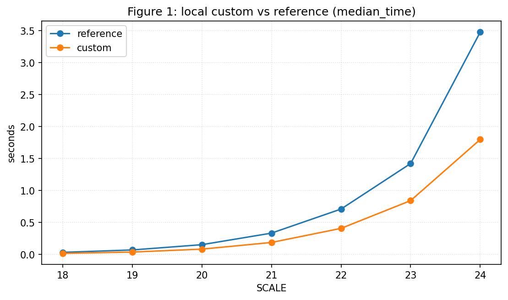
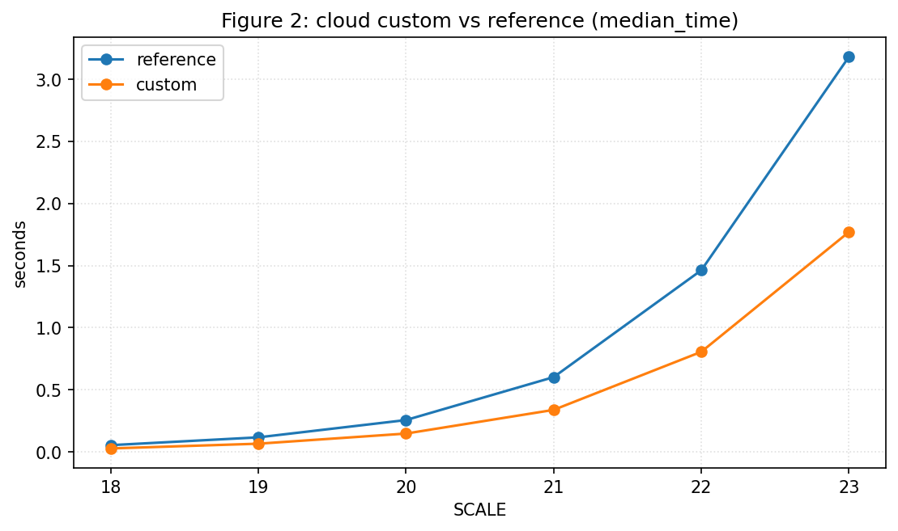
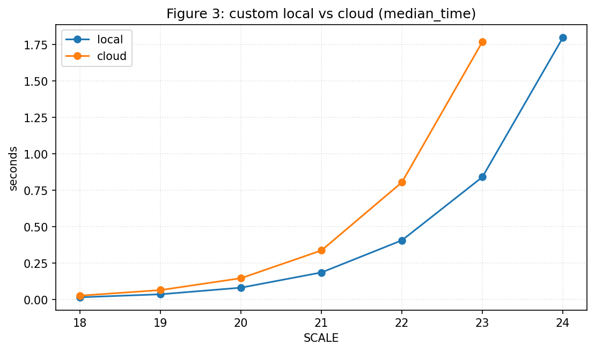
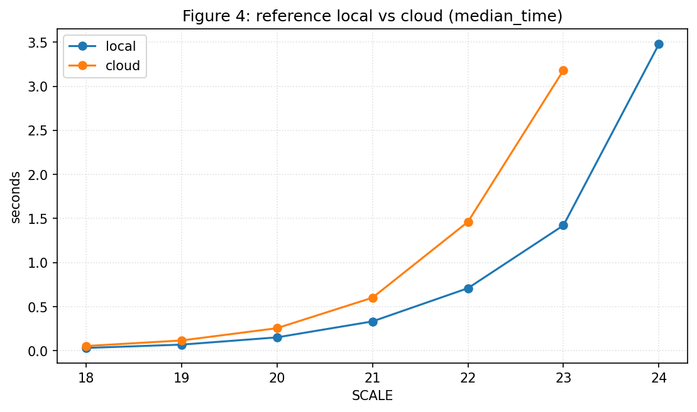

# HW1 BFS

## Table of Contents
- [Part I: Local-only BFS implementation and baseline comparison](#part-i-local-only-bfs-implementation-and-baseline-comparison)
- [Part II: Local vs Cloud benchmark extension](#part-ii-local-vs-cloud-benchmark-extension)

## Part I: Local-only BFS implementation and baseline comparison

### Objective
Implement a custom BFS based on Python logic, integrate it into Graph500 C framework, and compare against the reference BFS on local machine.

### Python BFS (logic reference)
```python

def bfs(graph, start):
	visited = set([start])
	order = []
	queue = deque([start])

	while queue:
		node = queue.popleft()
		order.append(node)
		for neighbor in graph.get(node, []):
			if neighbor not in visited:
				visited.add(neighbor)
				queue.append(neighbor)

	return order
```

Because the Python version cannot be used directly in Graph500, I rewrote it in C and placed it into the custom BFS entry points in [src/bfs_custom.c](src/bfs_custom.c).
The C custom BFS follows the same core logic (queue + visited), translated into Graph500's CSR layout and data structures.

### Implementation Overview
- Python BFS implementation: see [bfs.py](bfs.py)
- Customed C BFS implementation (based on Graph500 framework): see [src/bfs_custom.c](src/bfs_custom.c)
- Graph500 Reference implementation: see [src/bfs_reference.c](src/bfs_reference.c)

### Repository Paths (Part I)
- Main benchmark source directory: [src/](src)
- Part I implementation files:
	- [bfs.py](bfs.py)
	- [src/bfs_custom.c](src/bfs_custom.c)
	- [src/bfs_reference.c](src/bfs_reference.c)
- Part I single-run output examples:
	- [src/graph500_reference_bfs_stdout.txt](src/graph500_reference_bfs_stdout.txt)
	- [src/graph500_custom_bfs_stdout.txt](src/graph500_custom_bfs_stdout.txt)

### Experiment Setup and Outputs
Experiment notes:
- Each run uses 64 BFS roots (NBFS=64).
- Single-process execution on macOS.
- Scales tested: SCALE=10, 16, 20, 22, 24.

Saved output logs:
- Reference stdout/stderr: [src/graph500_reference_bfs_stdout.txt](src/graph500_reference_bfs_stdout.txt) / [src/graph500_reference_bfs_stderr.txt](src/graph500_reference_bfs_stderr.txt)
- Custom stdout/stderr: [src/graph500_custom_bfs_stdout.txt](src/graph500_custom_bfs_stdout.txt) / [src/graph500_custom_bfs_stderr.txt](src/graph500_custom_bfs_stderr.txt)

### Part I Figures
Comparison Plot (SCALE=10)


Comparison Plot (SCALE=16)


Comparison Plot (SCALE=20)


Comparison Plot (SCALE=22)


Comparison Plot (SCALE=24)


Line Plot (median_time & harmonic_mean_TEPS)


Plots are generated by [compare_results.py](compare_results.py).

### Part I Commands
Reference (SCALE=10):
```
 ./graph500_reference_bfs 10
```
Custom (SCALE=10): 
```
 ./graph500_custom_bfs 10
```

### Part I Analysis
Under single-process execution, the custom BFS achieves lower runtime and higher TEPS than the Graph500 reference implementation at both SCALE=10 and SCALE=16. This is expected because the reference code is designed for parallel and distributed environments and retains additional abstraction and coordination overhead, which does not provide an advantage in a purely local setting. As SCALE increases, the performance gap narrows.

### Part I Conclusion
In the local-only baseline, custom BFS consistently outperforms reference BFS, and the performance trend is stable across tested scales.

## Part II: Local vs Cloud benchmark extension

### Objective
Extend Part I with cloud benchmarking and evaluate whether the relative performance conclusion still holds across environments (local M1 vs EC2).

### Setup and Experiment Scope
- Keep the original implementation unchanged (`reference` and `custom` binaries).
- Add automated benchmark collection for two locations: `local` and `cloud`.
- Use SCALE range 18..24 (or selected scales for targeted runs).
- Use `bfs_median_time` as the primary comparison metric for robustness.

### Data Collection Pipeline

This project now provides scripts to run reference/custom BFS automatically for scales 18..24,
and save parsed metrics into one unified result file.

### Repository Paths (Part II)
- Benchmark automation scripts:
	- [benchmark_pipeline.py](benchmark_pipeline.py)
	- [run_benchmark_local.py](run_benchmark_local.py)
	- [run_benchmark_cloud.py](run_benchmark_cloud.py)
- Results root directory: [result/](result)
- Unified CSV file: [result/benchmark_results.csv](result/benchmark_results.csv)
- Raw logs:
	- Local runs: [result/raw/local/](result/raw/local)
	- Cloud runs: [result/raw/cloud/](result/raw/cloud)
- Plot script and output directory:
	- [compare_results.py](compare_results.py)
	- [result/plots/](result/plots)

Scripts:
- `run_benchmark_local.py`  -> writes rows with `location=local`
- `run_benchmark_cloud.py`  -> writes rows with `location=cloud`

Output files:
- Unified CSV: `result/benchmark_results.csv`
- Raw logs per run:
	- `result/raw/local/scale_<N>/reference_stdout.txt`
	- `result/raw/local/scale_<N>/custom_stdout.txt`
	- `result/raw/cloud/scale_<N>/reference_stdout.txt`
	- `result/raw/cloud/scale_<N>/custom_stdout.txt`

CSV columns (aligned with parser output):
- `timestamp_utc`
- `location` (`local` or `cloud`)
- `scale`
- `impl` (`reference` or `custom`)
- `binary`
- `bfs_min_time`
- `bfs_median_time`
- `bfs_mean_time`
- `stdout_file`
- `stderr_file`

Dedup/update rule:
- Primary key is `(location, scale, impl)`.
- Re-running the same key updates that row (no duplicate rows).

### Part II Commands

Run examples:
```bash
python run_benchmark_local.py
python run_benchmark_cloud.py

# Optional: run only one scale
python benchmark_pipeline.py --location local --scales 18
python benchmark_pipeline.py --location cloud --scales 18

# Optional: run multi-core with MPI processes
python run_benchmark_local.py --scales 24 --np 8
python run_benchmark_cloud.py --scales 24 --np 8

# Generate multi-figure comparison plots from result CSV
python compare_results.py --from-csv --csv result/benchmark_results.csv --out-dir result/plots
```

### Part II Figures (median_time)

Figure 1: local custom vs reference



Figure 2: cloud custom vs reference



Figure 3: custom local vs cloud



Figure 4: reference local vs cloud



### Part II Analysis

- Within the same location, `custom` consistently achieves lower `bfs_median_time` than `reference`.
- Runtime increases with SCALE on both local and cloud, showing expected workload growth behavior.
- In cross-platform comparison (`local` vs `cloud`), both implementations follow similar scaling trends while absolute runtimes differ by hardware/runtime environment.
- `bfs_median_time` is more stable than mean-time-based comparison and is therefore used as the primary indicator.

### Part II Conclusion

The cloud extension confirms the same core result observed locally: the custom BFS remains faster than the reference BFS under the tested settings. The local-vs-cloud plots further show that although absolute runtimes depend on platform configuration (instance type, MPI process count, system load), the relative ranking (`custom` better than `reference`) is stable across environments. Therefore, the optimization effect of the custom implementation is reproducible, not limited to a single machine.
