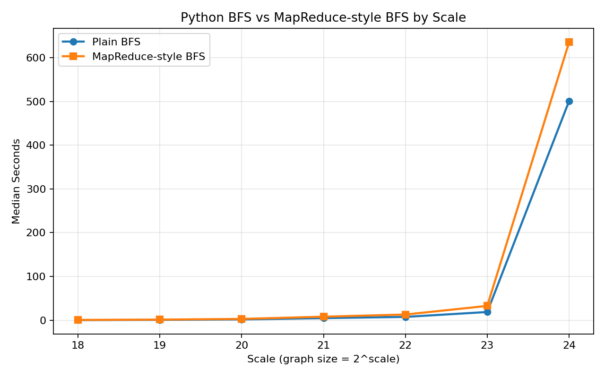

# HW1 BFS

## Table of Contents
- [Part I: Local-only BFS implementation and baseline comparison](#part-i-local-only-bfs-implementation-and-baseline-comparison)
- [Part II: Local vs Cloud benchmark extension](#part-ii-local-vs-cloud-benchmark-extension)
- [Part III: Python BFS vs MapReduce-style BFS](#part-iii-python-bfs-vs-mapreduce-style-bfs)

## Part I: Local-only BFS implementation and baseline comparison

### Objective
Implement a custom BFS based on Python logic, integrate it into Graph500 C framework, and compare against the reference BFS on local machine.

### Python BFS (logic reference)
```python

def bfs(graph, start):
	visited = set([start])
	order = []
	queue = deque([start])

	while queue:
		node = queue.popleft()
		order.append(node)
		for neighbor in graph.get(node, []):
			if neighbor not in visited:
				visited.add(neighbor)
				queue.append(neighbor)

	return order
```

Because the Python version cannot be used directly in Graph500, I rewrote it in C and placed it into the custom BFS entry points in [src/bfs_custom.c](src/bfs_custom.c).
The C custom BFS follows the same core logic (queue + visited), translated into Graph500's CSR layout and data structures.

### Implementation Overview
- Python BFS implementation: see [bfs.py](bfs.py)
- Customed C BFS implementation (based on Graph500 framework): see [src/bfs_custom.c](src/bfs_custom.c)
- Graph500 Reference implementation: see [src/bfs_reference.c](src/bfs_reference.c)

### Repository Paths (Part I)
- Main benchmark source directory: [src/](src)
- Part I implementation files:
	- [bfs.py](bfs.py)
	- [src/bfs_custom.c](src/bfs_custom.c)
	- [src/bfs_reference.c](src/bfs_reference.c)
- Part I single-run output examples:
	- [src/graph500_reference_bfs_stdout.txt](src/graph500_reference_bfs_stdout.txt)
	- [src/graph500_custom_bfs_stdout.txt](src/graph500_custom_bfs_stdout.txt)

### Experiment Setup and Outputs
Experiment notes:
- Each run uses 64 BFS roots (NBFS=64).
- Single-process execution on macOS.
- Scales tested: SCALE=10, 16, 20, 22, 24.

Saved output logs:
- Reference stdout/stderr: [src/graph500_reference_bfs_stdout.txt](src/graph500_reference_bfs_stdout.txt) / [src/graph500_reference_bfs_stderr.txt](src/graph500_reference_bfs_stderr.txt)
- Custom stdout/stderr: [src/graph500_custom_bfs_stdout.txt](src/graph500_custom_bfs_stdout.txt) / [src/graph500_custom_bfs_stderr.txt](src/graph500_custom_bfs_stderr.txt)

### Part I Figures
Comparison Plot (SCALE=10)


Comparison Plot (SCALE=16)


Comparison Plot (SCALE=20)


Comparison Plot (SCALE=22)


Comparison Plot (SCALE=24)


Line Plot (median_time & harmonic_mean_TEPS)


Plots are generated by [compare_results.py](compare_results.py).

### Part I Commands
Reference (SCALE=10):
```
 ./graph500_reference_bfs 10
```
Custom (SCALE=10): 
```
 ./graph500_custom_bfs 10
```

### Part I Analysis
Under single-process execution, the custom BFS achieves lower runtime and higher TEPS than the Graph500 reference implementation at both SCALE=10 and SCALE=16. This is expected because the reference code is designed for parallel and distributed environments and retains additional abstraction and coordination overhead, which does not provide an advantage in a purely local setting. As SCALE increases, the performance gap narrows.

### Part I Conclusion
In the local-only baseline, custom BFS consistently outperforms reference BFS, and the performance trend is stable across tested scales.

## Part II: Local vs Cloud benchmark extension

### Objective
Extend Part I with cloud benchmarking and evaluate whether the relative performance conclusion still holds across environments (local M1 vs EC2).

### Setup and Experiment Scope
- Keep the original implementation unchanged (`reference` and `custom` binaries).
- Add automated benchmark collection for two locations: `local` and `cloud`.
- Use SCALE range 18..24 (or selected scales for targeted runs).
- Use `bfs_median_time` as the primary comparison metric for robustness.

### Data Collection Pipeline

This project now provides scripts to run reference/custom BFS automatically for scales 18..24,
and save parsed metrics into one unified result file.

### Repository Paths (Part II)
- Benchmark automation scripts:
	- [benchmark_pipeline.py](benchmark_pipeline.py)
	- [run_benchmark_local.py](run_benchmark_local.py)
	- [run_benchmark_cloud.py](run_benchmark_cloud.py)
- Results root directory: [result/](result)
- Unified CSV file: [result/benchmark_results.csv](result/benchmark_results.csv)
- Raw logs:
	- Local runs: [result/raw/local/](result/raw/local)
	- Cloud runs: [result/raw/cloud/](result/raw/cloud)
- Plot script and output directory:
	- [compare_results.py](compare_results.py)
	- [result/plots/](result/plots)

Scripts:
- `run_benchmark_local.py`  -> writes rows with `location=local`
- `run_benchmark_cloud.py`  -> writes rows with `location=cloud`

Output files:
- Unified CSV: `result/benchmark_results.csv`
- Raw logs per run:
	- `result/raw/local/scale_<N>/reference_stdout.txt`
	- `result/raw/local/scale_<N>/custom_stdout.txt`
	- `result/raw/cloud/scale_<N>/reference_stdout.txt`
	- `result/raw/cloud/scale_<N>/custom_stdout.txt`

CSV columns (aligned with parser output):
- `timestamp_utc`
- `location` (`local` or `cloud`)
- `scale`
- `impl` (`reference` or `custom`)
- `binary`
- `bfs_min_time`
- `bfs_median_time`
- `bfs_mean_time`
- `stdout_file`
- `stderr_file`

Dedup/update rule:
- Primary key is `(location, scale, impl)`.
- Re-running the same key updates that row (no duplicate rows).

### Part II Commands

Run examples:
```bash
python run_benchmark_local.py
python run_benchmark_cloud.py

# Optional: run only one scale
python benchmark_pipeline.py --location local --scales 18
python benchmark_pipeline.py --location cloud --scales 18

# Optional: run multi-core with MPI processes
python run_benchmark_local.py --scales 24 --np 8
python run_benchmark_cloud.py --scales 24 --np 8

# Generate multi-figure comparison plots from result CSV
python compare_results.py --from-csv --csv result/benchmark_results.csv --out-dir result/plots
```

### Part II Figures (median_time)

Figure 1: local custom vs reference


Figure 2: cloud custom vs reference


Figure 3: custom local vs cloud


Figure 4: reference local vs cloud


### Part II Analysis

- Within the same location, `custom` consistently achieves lower `bfs_median_time` than `reference`.
- Runtime increases with SCALE on both local and cloud, showing expected workload growth behavior.
- In cross-platform comparison (`local` vs `cloud`), both implementations follow similar scaling trends while absolute runtimes differ by hardware/runtime environment.
- `bfs_median_time` is more stable than mean-time-based comparison and is therefore used as the primary indicator.

### Part II Conclusion

The cloud extension confirms the same core result observed locally: the custom BFS remains faster than the reference BFS under the tested settings. The local-vs-cloud plots further show that although absolute runtimes depend on platform configuration (instance type, MPI process count, system load), the relative ranking (`custom` better than `reference`) is stable across environments. At the same time, one practical limitation in this benchmark is that both reference and custom runs are single-core by default (unless explicitly configured with multi-process settings), so the usable compute resources and memory bandwidth are limited. Because of this, even on higher-performance cloud VMs, the observed gap may remain small and the hardware advantage may not be fully reflected. Therefore, the optimization effect of the custom implementation is reproducible, not limited to a single machine, while absolute cross-platform differences should be interpreted together with resource-utilization constraints.

## Part III: Python BFS vs MapReduce-style BFS

### Objective
Build a pure-Python experiment to compare a standard queue-based BFS with a MapReduce-style BFS, without modifying the original Graph500 C/MPI kernels.

### Motivation
Parts I and II use the original Graph500 C/MPI code path and focus on performance comparison inside the Graph500 framework. Part III switches to a pure Python experiment so that the MapReduce-style BFS idea can be implemented and compared more directly at the algorithm level.

Implementing a true MapReduce-style BFS directly inside the C Graph500 codebase would require a large amount of extra machinery for intermediate key-value storage, grouping, synchronization, and repeated level-by-level data movement. To keep the focus on the algorithmic idea rather than low-level systems engineering, this part uses Python as a lightweight experimental layer.

### MapReduce-style BFS Design
The standard BFS keeps one explicit queue and expands vertices one by one. In contrast, the MapReduce-style BFS processes the graph level by level:

1. Treat the current frontier as the active input set.
2. In the map phase, emit all neighbor candidates reachable from the current frontier.
3. Group emitted candidates by destination vertex.
4. In the reduce phase, keep only vertices that have not been visited before and form the next frontier.
5. Repeat until the frontier becomes empty.

This design captures the main MapReduce idea: local expansion first, then global grouping and deduplication at each BFS level. In the Python implementation, the grouping is simulated with dictionaries rather than an external distributed framework, but the control flow still follows the MapReduce model.

### Implementation Overview
- Standard Python BFS implementation: see [python_bfs_exp/bfs.py](python_bfs_exp/bfs.py)
- MapReduce-style BFS implementation: see [python_bfs_exp/mr_bfs.py](python_bfs_exp/mr_bfs.py)
- Random graph generator: see [python_bfs_exp/graph_gen.py](python_bfs_exp/graph_gen.py)
- Benchmark pipeline: see [python_bfs_exp/benchmark.py](python_bfs_exp/benchmark.py)
- Plot script: see [python_bfs_exp/plot_results.py](python_bfs_exp/plot_results.py)
- Outer benchmark entry script: see [run_mr_python_bfs_benchmark.py](run_mr_python_bfs_benchmark.py)

Unlike Parts I and II, this part does not call the Graph500 binaries in [src/](src). Instead, it builds the graph, runs BFS, collects timing results, and generates plots entirely within the Python experiment directory.

### Repository Paths (Part III)
- Python experiment directory: [python_bfs_exp/](python_bfs_exp)
- Part III implementation files:
	- [python_bfs_exp/bfs.py](python_bfs_exp/bfs.py)
	- [python_bfs_exp/mr_bfs.py](python_bfs_exp/mr_bfs.py)
	- [python_bfs_exp/graph_gen.py](python_bfs_exp/graph_gen.py)
	- [python_bfs_exp/benchmark.py](python_bfs_exp/benchmark.py)
	- [python_bfs_exp/plot_results.py](python_bfs_exp/plot_results.py)
- Part III entry script:
	- [run_mr_python_bfs_benchmark.py](run_mr_python_bfs_benchmark.py)
- Part III output files:
	- [python_bfs_exp/benchmark_results.csv](python_bfs_exp/benchmark_results.csv)
	- [python_bfs_exp/benchmark_summary.csv](python_bfs_exp/benchmark_summary.csv)
	- [python_bfs_exp/benchmark_comparison.png](python_bfs_exp/benchmark_comparison.png)

### Experiment Setup and Outputs
Experiment notes:
- This part uses a pure Python benchmark and does not modify the original Graph500 C/MPI kernels.
- Scales tested: 18, 19, 20, 21, 22, 23, 24.
- Graph size per scale: `2^scale`.
- Graph type: sparse random undirected graph generated in Python.
- Average degree target: 8.
- Each scale uses 5 BFS roots.
- Each root is repeated 3 times for each implementation.
- Each scale therefore produces 15 runs per implementation.
- `median_seconds` is used as the primary comparison metric.

Random graph generation notes:
- For each scale, the benchmark generates one sparse random undirected graph in Python.
- The graph size is controlled by `2^scale`, similar to the scale-based setup used in the earlier Graph500 experiments.
- The generator targets a fixed average degree so that larger scales mainly reflect graph-size growth rather than a changing density setting.

Saved output files:
- Detailed per-run results: [python_bfs_exp/benchmark_results.csv](python_bfs_exp/benchmark_results.csv)
- Aggregated summary results: [python_bfs_exp/benchmark_summary.csv](python_bfs_exp/benchmark_summary.csv)
- Comparison figure: [python_bfs_exp/benchmark_comparison.png](python_bfs_exp/benchmark_comparison.png)

### Data Collection Pipeline
This part provides a Python-only benchmark pipeline that compares `plain_bfs` and `mapreduce_bfs` over scales 18..24 and saves both detailed and aggregated outputs.

Per scale, the benchmark:
- Generates one sparse random graph.
- Samples multiple non-isolated roots.
- Runs both implementations on the same graph and roots.
- Repeats each root multiple times to reduce timing noise.
- Writes detailed rows and aggregated min/median/mean statistics.

This mirrors the benchmark style used earlier in the project: run the same workload configuration at multiple scales, repeat measurements to reduce noise, and summarize the results with aggregated timing metrics.

Summary CSV columns:
- `scale`
- `graph_size`
- `implementation`
- `runs`
- `min_seconds`
- `median_seconds`
- `mean_seconds`
- `mean_visited_count`
- `mean_levels`
- `mean_mapped_pairs`

### Part III Commands
Run the full benchmark:

```bash
python3 run_mr_python_bfs_benchmark.py
```

Optional: run selected scales or override benchmark settings:

```bash
python3 run_mr_python_bfs_benchmark.py --scales 18 20 22 --roots 5 --repeats 3 --avg-degree 8
```

Generate the median-time comparison plot:

```bash
python3 python_bfs_exp/plot_results.py --metric median_seconds
```

Optional: generate min-time or mean-time plots:

```bash
python3 python_bfs_exp/plot_results.py --metric min_seconds --output python_bfs_exp/benchmark_min_comparison.png
python3 python_bfs_exp/plot_results.py --metric mean_seconds --output python_bfs_exp/benchmark_mean_comparison.png
```

### Part III Figures
Median runtime comparison across scales:



### Part III Analysis
- Across all tested scales, the standard Python BFS is consistently faster than the MapReduce-style BFS.
- The performance gap is expected because the MapReduce-style version introduces extra grouping and deduplication work at every BFS level, which creates more intermediate data and more synchronization-like overhead.
- Both implementations show increasing runtime as scale increases, which matches the growth in graph size and traversal workload.
- The MapReduce-style BFS still visits the same set of vertices as the standard BFS, so the correctness trend is consistent even though the execution model is heavier.
- The benchmark also records `mapped_pairs` and BFS levels for the MapReduce-style implementation, showing that intermediate work grows rapidly with scale and helps explain the runtime difference.
- At `scale=24`, both implementations show substantially larger variance than at smaller scales. This suggests that Python memory pressure and runtime environment effects become significant at that size, so that point should be interpreted more carefully than the smaller scales.

### Part III Conclusion
The Python experiment shows that a MapReduce-style BFS is a useful conceptual model for level-synchronous graph traversal, but it is not the most efficient approach for this workload on a single machine. Compared with a standard queue-based BFS, the MapReduce-style implementation pays a clear cost for repeated frontier grouping and deduplication. Therefore, this part complements Parts I and II by demonstrating a different programming model for BFS, while also showing why a simpler direct BFS remains the better practical choice for local execution.
