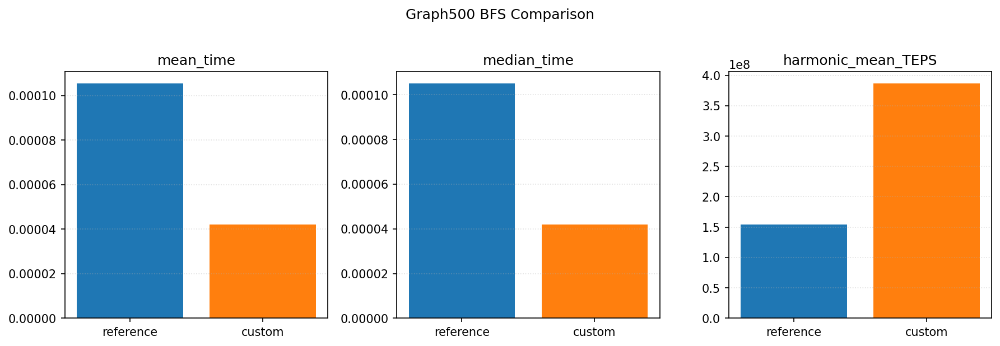

# Graph500 Assignment Notes

## Python BFS (logic reference)
```python

def bfs(graph, start):
	visited = set([start])
	order = []
	queue = deque([start])

	while queue:
		node = queue.popleft()
		order.append(node)
		for neighbor in graph.get(node, []):
			if neighbor not in visited:
				visited.add(neighbor)
				queue.append(neighbor)

	return order
```

The C custom BFS follows the same core logic (queue + visited), translated into Graph500's CSR layout and data structures.

## Implementation Overview
- Python BFS implementation: see [bfs.py](bfs.py)
- C BFS implementation (custom, based on Graph500 framework): see [src/bfs_custom.c](src/bfs_custom.c)
- Reference implementation: see [src/bfs_reference.c](src/bfs_reference.c)

## Run Outputs
Saved output logs:
- Reference stdout/stderr: [src/graph500_reference_bfs_stdout.txt](src/graph500_reference_bfs_stdout.txt) / [src/graph500_reference_bfs_stderr.txt](src/graph500_reference_bfs_stderr.txt)
- Custom stdout/stderr: [src/graph500_custom_bfs_stdout.txt](src/graph500_custom_bfs_stdout.txt) / [src/graph500_custom_bfs_stderr.txt](src/graph500_custom_bfs_stderr.txt)

## Comparison Plot


## Analysis
- The custom version uses a simpler local BFS flow, so the path is shorter and overhead is lower.
- The reference version targets a general parallel/distributed setup; even in single-process mode it includes messaging/synchronization overhead.
